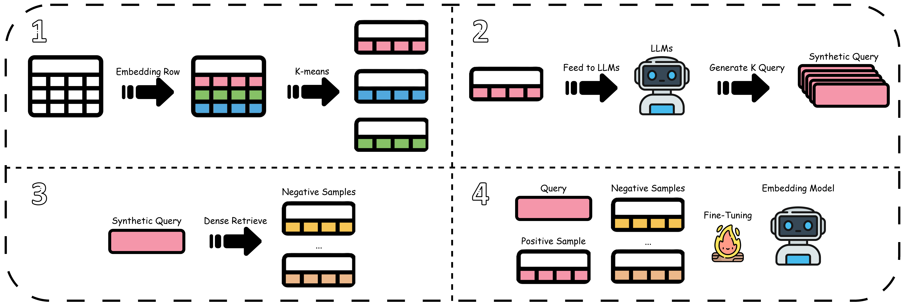

# CGPT: Cluster-Guided Partial Tables with LLM-Generated Supervision for Table Retrieval

<p align="center">
  <a href="https://doi.org/10.1145/3774904.3792916"></a>
  <a href="#"></a>
  <a href="https://pytorch.org/"></a>
  <a href="https://huggingface.co/BAAI/bge-m3"></a>
</p>

<p align="center">
  <b>Tsung-Hsiang Chou</b>, <b>Chen-Jui Yu</b>, <b>Shui-Hsiang Hsu</b>, <b>Yao-Chung Fan</b>
  <br>
  National Chung Hsing University, Taiwan
</p>

---

## Overview

**CGPT** is a training framework that enhances table retrieval through LLM-generated supervision. It addresses the semantic compression problem in table retrieval by:

1. **Clustering-based Partial Table Generation** - Using K-means to construct semantically diverse partial tables
2. **Synthetic Query Generation** - Leveraging LLMs to generate training queries
3. **Hard Negative Sampling** - Selecting challenging negatives for contrastive learning
4. **Contrastive Fine-tuning** - Training embedding models with InfoNCE loss

<p align="center">
  
</p>

---

## Installation

```bash
# Clone the repository
git clone https://github.com/yumeow0122/CGPT.git
cd CGPT

# Install dependencies using uv
uv sync
```

## Usage

### Step 1: K-means Partial Table Generation

```bash
uv run python method/chunk_table.py \
    --input data/table.jsonl \
    --output data/chunk.jsonl \
    --gpu-ids 0 \
    --min-instances-per-chunk 10 \
    --max-chunks-per-table 5 \
    --max-instances-per-representation 5
```

### Step 2: Synthetic Query Generation

```bash
uv run python method/synthetic_question.py \
    --corpus data/chunk.jsonl \
    --output data/trainset.jsonl \
    --lang zh \
    --questions-per-chunk 5
```

### Step 3: Hard Negative Sampling

```bash
uv run python method/hard_negative_sampling.py \
    --trainset-input data/trainset.jsonl \
    --corpus data/chunk.jsonl \
    --output data/trainset_with_neg.jsonl \
    --num-negatives 8 \
    --gpu-id 0
```

### Step 4: Contrastive Fine-tuning

```bash
bash method/train.sh
```

## Hyperparameters

| Parameter | Default | Description |
|-----------|---------|-------------|
| `min-instances-per-chunk` | 10 | Granularity parameter (r) for K-means |
| `max-chunks-per-table` | 5 | Maximum clusters per table (k_max) |
| `max-instances-per-representation` | 5 | Instances sampled per cluster (s) |
| `questions-per-chunk` | 5 | Synthetic queries per partial table (n_q) |
| `num-negatives` | 8 | Hard negatives per query (h) |
| `learning-rate` | 1e-5 | Fine-tuning learning rate |
| `epochs` | 2 | Training epochs |
| `temperature` | 0.01 | InfoNCE temperature (τ) |

---

## Key Results

CGPT achieves significant improvements over existing baselines with an **average R@1 improvement of 16.54%** across four public benchmarks.

| Method | MimoTable (CH) | MimoTable (EN) | OTTQA | FetaQA | E2E-WTQ |
|--------|:--------------:|:--------------:|:-----:|:------:|:-------:|
| QGpT   | 50.60 | 50.66 | 51.45 | 33.95 | 41.49 |
| **CGPT** | **56.80** | **60.13** | **86.86** | **34.90** | **72.20** |
| *Δ Improvement* | +6.20 | +9.47 | +35.41 | +0.95 | +30.71 |

## Datasets

We evaluate CGPT on four public benchmarks:

- **MimoTable** (Chinese & English)
- **OTTQA** - Open Table-and-Text Question Answering
- **FetaQA** - Free-form Table Question Answering
- **E2E-WTQ** - End-to-End WikiTableQuestions

## Citation

If you find this work useful, please cite our paper:

```bibtex
@article{chou2026cgpt,
  title={CGPT: Cluster-Guided Partial Tables with LLM-Generated Supervision for Table Retrieval},
  author={Chou, Tsung-Hsiang and Yu, Chen-Jui and Hsu, Shui-Hsiang and Fan, Yao-Chung},
  journal={arXiv preprint arXiv:2601.15849},
  year={2026}
}
```

## Acknowledgments

This research was supported by NSTC 114-2634-F-005-002 - project Smart Sustainable New Agriculture Research Center (SMARTer), project no. 112-2221-E-005-075-MY3, and Delta Research Center.

## License

This project is licensed under the [CC BY 4.0 License](https://creativecommons.org/licenses/by/4.0/).
